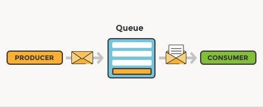

# Desafio tecnico

## Documentação da API de Cadastro

Esta documentação detalha a implementação de uma rota de cadastro dentro de uma arquitetura baseada no AdonisJS, que utiliza um sistema de processamento assíncrono distribuído. A infraestrutura é projetada para ser escalável, permitindo o processamento eficiente de tarefas assíncronas através da integração com um message broker e o uso de consumers dedicados.



## Rota de Cadastro

- **Endpoint**: `/cadastro`
- **Método**: `POST`
- **Descrição**: Esta rota recebe solicitações para o cadastro de novos usuários, validando os dados fornecidos antes de prosseguir com o cadastro.

### Corpo da Requisição

```json
{
  "name": "Nome do Usuário",
  "email": "email@exemplo.com",
  "phone": "123456789"
}
```

Respostas
Sucesso (200 OK)
Quando os dados são validados e o usuário é cadastrado com sucesso.

```json
{
  "message": "Usuário cadastrado com sucesso."
}
```

Erro de Validação (400 Bad Request)
Quando algum dos dados fornecidos não passa na validação. Os erros são retornados como uma lista.

```json
{
  "errors": [
    {"message": "O campo nome é obrigatório"},
    {"message": "O campo e-mail é obrigatório"},
    {"message": "O e-mail fornecido não é válido"},
    {"message": "Este e-mail já está em uso"},
    {"message": "O campo telefone é obrigatório"}
  ]
}
```

### Estrutura da Mensagem
As mensagens enviadas através do message broker contêm dois componentes principais:
- queue: Identificador da fila ou tópico para o qual a mensagem deve ser direcionada.
- routeJson: Um objeto JSON contendo os dados necessários para processar a mensagem na rota final.
```json
{
"payload": {
    "name": "Nome do Usuário",
    "email": "email@exemplo.com",
    "phone": "123456789"
  },
"routing_key": "nomeDaFila",
"headers": {
    "content_type": "application/json",
    "custom_header": "custom_value"
}
}
```

1. Instale as dependências do projeto

```npm i @adonisjs/validator && npm i --save-dev @types/amqplib```

2. Instale o XAMPP e ative os módulos do Apache e MYSQL

3. Rode as migrations

```node ace migration:refresh```

4. Rode seu projeto

```node ace serve --watch```